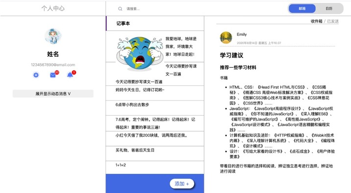

# HomeWork_Day2

## 预习作业：

学习 HTML 调试：[https://developer.mozilla.org/zh-CN/docs/Learn/HTML/Introduction_to_HTML/Debugging_HTML](https://developer.mozilla.org/zh-CN/docs/Learn/HTML/Introduction_to_HTML/Debugging_HTML)

用 HTML 实现信件 Demo：[https://developer.mozilla.org/zh-CN/docs/Learn/HTML/Introduction_to_HTML/Marking_up_a_letter](https://developer.mozilla.org/zh-CN/docs/Learn/HTML/Introduction_to_HTML/Marking_up_a_letter)

实现 loading 动画：[https://www.freecodecamp.org/news/how-to-build-a-delightful-loading-screen-in-5-minutes-847991da509f/](https://www.freecodecamp.org/news/how-to-build-a-delightful-loading-screen-in-5-minutes-847991da509f/)

使用 flex 布局实现一个方块在页面中的垂直水平居中

使用定位实现一个方块在页面中的垂直水平居中

尝试使用 flex 布局/定位去实现右图的布局；

写一个简单的响应式 demo：随屏幕大小变化方块的颜色
